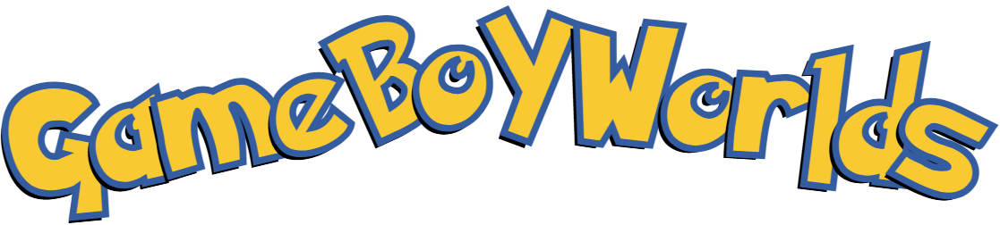
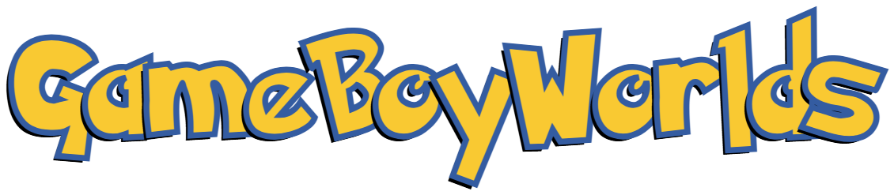
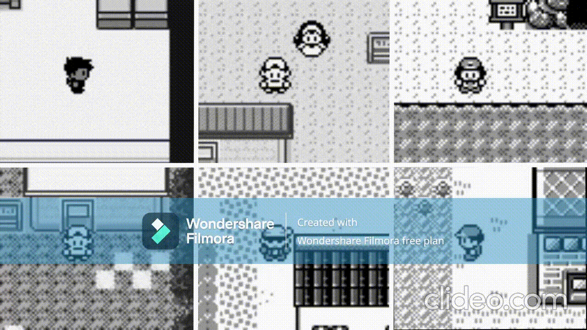
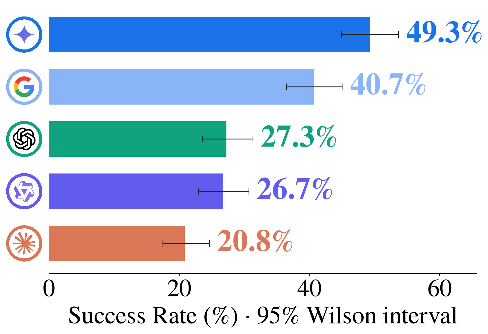
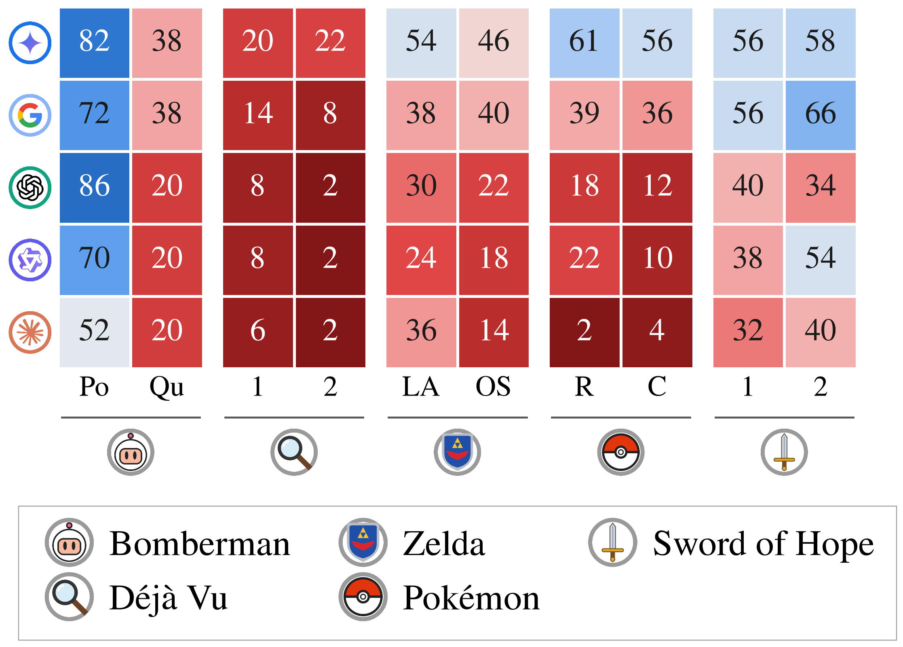
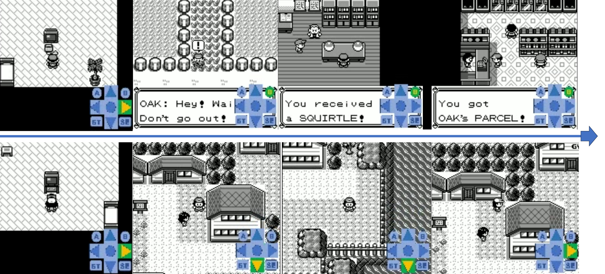
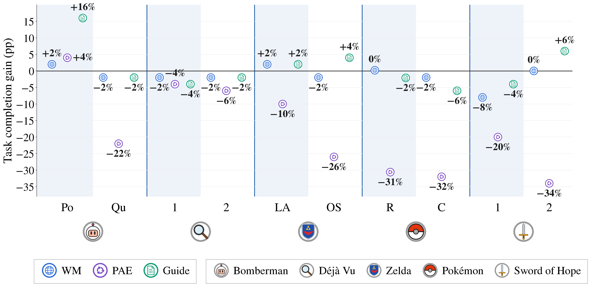

<div align="center">
  <picture>
    
  </picture>
  <br>

  **Benchmarking and Improving Agents in the GameBoy Universe**

  <br>
    <a href="https://github.com/DhananjayAshok/GameBoyRL/blob/main/LICENSE" target="_blank" rel="noopener noreferrer"></a>
    <a href="https://example.com" target="_blank" rel="noopener noreferrer"></a>
    <a href="https://example.com" target="_blank" rel="noopener noreferrer"></a>
    <a href="https://github.com/DhananjayAshok/GameBoyWorlds" target="_blank" rel="noopener noreferrer"></a>
</div>

<br>

Hi there!

## Overview

 is a suite of GameBoy and GameBoy Color games wrapped
in a single Gym-style interface, with unified state parsing and an abstracted action space that
lets a language model play by saying what it wants to do rather than which buttons to press.
Games range from the classics (Pokémon Red, Pokémon Crystal, The Legend of Zelda: Link's
Awakening) to obscure fan-made titles (Pokémon Brown, Pokémon Prism) that no model has read a
walkthrough for.



This repository is the agent side of that suite. With it we established two things:

- **Execution.** Given a short, well-specified task and the screen, frontier VLMs fail most of
  the time. We measure this over a fixed task set per game, scoring each task independently.
- **Playthrough.** Given a whole game and no task list at all, an agent that must choose its own
  goals, remember where it has been, and act over hundreds of episodes gets much further in
  games it has read about than in games it has not.

---

## What brings you here?

**Just curious.** The [project website](https://example.com) and [the paper](https://example.com)
are the short versions. Questions are welcome at
[ashokd@usc.edu](mailto:ashokd@usc.edu) — you do not need to read any further.

**You want to use GameBoyWorlds, or reproduce our results.** Read on.

---

## Setup

### 1. Clone

```bash
git clone https://github.com/DhananjayAshok/GameBoyRL
cd GameBoyRL
git submodule update --init --recursive GameBoyWorlds cleanrl
```

`GameBoyWorlds` is the environment suite and `cleanrl` is the RL backend. The third submodule,
`llm-utils`, is only needed to reproduce the PAE baseline and is left out here on purpose.

### 2. Create the environment

```bash
bash setup/create_env.sh --env_dir /path/to/env
```

This creates a Python 3.12 virtual environment at `env_dir` with `uv`, symlinks it to
`setup/.venv`, installs everything from `setup/pyproject.toml`, and writes the `config.env`
files for both this repo and GameBoyWorlds.

<details>
<summary>Manual alternative</summary>

```bash
uv venv /path/to/env --python 3.12
ln -s /path/to/env setup/.venv
cd setup && uv sync && cd ..
source setup/.venv/bin/activate
python configs/create_env_file.py
python GameBoyWorlds/configs/create_env_file.py
```
</details>

### 3. Configure

Edit `configs/private_vars.yaml`:

```yaml
storage_dir: "/path/to/your/storage"
huggingface_repo_namespace: "your-username"
huggingface_repo_name: "your-repo"
```

`storage_dir` holds the heavy artifacts (trajectories, tasks, documents, checkpoints). Results
— CSVs, plots, debug reports — go to `results_dir`, which defaults to `results/` inside the
repo; change it in `configs/project_vars.yaml` if you want them elsewhere.

Set a storage directory in `GameBoyWorlds/configs/private_vars.yaml` too. It does **not** have
to be the same path — GameBoyWorlds storage (ROMs, save states, recorded sessions) is
independent of this repo's storage (tasks, trajectories, documents).

Model access is read from the environment, not from any config file. Export whichever of these
you plan to use:

```bash
# Both must be exported and visible to the process that runs the commands below.
export OPENAI_API_KEY=...
export OPENROUTER_API_KEY=...
```

### 4. ROMs

Nothing will run until the ROMs are in place. Every ROM lives at

```
<GameBoyWorlds_storage_dir>/rom_data/<game_name>/ROM_NAME.extension
```

See [the ROM Setup section of the GameBoyWorlds README](GameBoyWorlds/README.md#rom-setup) for
the list of supported games, how to obtain each one legally, and the exact expected path.

### 5. (Optional) llm-utils, for the PAE baseline only

```bash
git submodule update --init --recursive llm-utils
bash setup/create_llm_utils_env.sh --env_dir /path/to/llm-env
```

This is a second, separate environment — fine-tuning pulls in a training stack that we keep out
of the main one. Skip it unless you are reproducing PAE.

<details>
<summary>Manual alternative</summary>

```bash
uv venv /path/to/llm-env --python 3.12
ln -s /path/to/llm-env llm-utils/setup/.venv
cd llm-utils/setup && uv sync
```
</details>

---

## Verify your setup

**GameBoyWorlds.** All three demos should work:

```bash
python GameBoyWorlds/demos/emulator.py --game pokemon_red --play_mode human
python GameBoyWorlds/demos/environment.py --game pokemon_red
python GameBoyWorlds/demos/benchmark.py --game pokemon_red
```

The first opens a window you can play with the keyboard; the other two step the environment
programmatically. If any of them cannot find a ROM, go back to step 4.

**GameBoyRL.** One benchmark task against a cheap model:

```bash
bash scripts/benchmark/run_benchmark.sh \
    --game pokemon_red \
    --supervisor subgoal \
    --executor single_visual \
    --executor_vlm_model gpt-4o-mini \
    --executor_vlm_kind openai \
    --n_tasks 1
```

This needs `OPENAI_API_KEY`. If it finishes and writes a CSV, your install is good.

---

## Run a model on GameBoyWorlds-Execution

Execution is the short-task benchmark: a fixed list of tasks per game, each scored on its own,
with success decided by the environment rather than by a judge. The arm we report is the
**subgoal** supervisor over the **single_visual** executor.

```bash
bash scripts/benchmark/run_benchmark.sh \
    --game pokemon_red \
    --supervisor subgoal \
    --executor single_visual \
    --executor_vlm_model google/gemini-2.5-flash \
    --executor_vlm_kind openrouter
```

Any model OpenRouter serves works as `--executor_vlm_model`. To run a local model instead, swap
`--executor_vlm_kind` for `vllm` (point it at a server started with
`scripts/core/serve_vllm.sh`) or `huggingface` (loads the weights in-process). Nothing else
about the command changes.

### Where the artifacts go

- **The scores.** `<results_dir>/benchmark/<game>/subgoal_single_visual_low_level_<model>.csv`,
  one row per task: whether it succeeded, how many steps it took, how many actions were
  invalid, which subgoals it reached, and the session directories it wrote.
- **The full record.** Each row's `session_dirs` points into GameBoyWorlds' `sessions/`
  directory, and each of those holds a `report.pkl.gz` — every supervisor call and every
  executor leg underneath it, with the images the model saw, the prompt, the raw response and
  the actions it produced. This is the artifact worth keeping; the CSV is a summary of it.
- **Video.** Recorded per session unless you pass `--save_video false`.

### Looking at what happened

`debug.py` reads those artifacts and writes markdown reports (with frames) under
`<results_dir>/debug/<game>/`. It never calls a model and never trains anything.

```bash
python debug.py --game pokemon_red --executor single_visual benchmark --supervisor subgoal
```

You get one `episodes_<model>.md` per model — a frame-by-frame walk through each episode — and
a `comparison.md` when two models are present.

### Results





---

## Run a model on GameBoyWorlds-Playthrough

Playthrough is the opposite shape. There is no task list. One emulator session runs for
hundreds of episodes while a strategist picks its own goals, and the thing that improves over
time is not a score but the agent's own memory of the world.

```bash
python run_strategist.py \
    --game pokemon_red \
    --name gemini_run \
    --init_state starter \
    --model google/gemini-2.5-flash \
    --vlm_kind openrouter \
    --max_episodes 400
```

`--name` is the identity of the playthrough. State is resumed by default, so re-running the same
name continues where it left off rather than starting over. `--init_state starter` begins at the
point where the first party member is chosen; `initial` is the true start of the game. You can
override the model per layer with `--strategist_vlm_model`, `--supervisor_vlm_model` and
`--executor_vlm_model`.

### Where the artifacts go

The playthrough's memory lives at
`<storage_dir>/playthrough_artifacts/<game>/strategist/<name>/`, and it is the point of the
whole exercise. Five artifacts, each saved per episode:

| Artifact | What it holds |
|----------|---------------|
| `goals` | The goal tree — what the strategist is trying to do, and how it decomposed it |
| `locations` | The map it has built: places it has seen, and how they connect |
| `knowledge` | What it believes about the game's mechanics and its own situation |
| `tiles` | The tile recognizer, shared across playthroughs of the same game |
| `notepad` | Free-text thoughts it wrote to itself |

Alongside them, `provenance_<stamp>.json` records the settings each process ran under, and the
per-episode `report.pkl.gz` files hold the same full call records as Execution. Video goes to
GameBoyWorlds' `sessions/<game>/strategist/<name>/videos/`.

### Looking at what happened

Two views, both under `debug.py strategist`:

```bash
# Every artifact as it stood at one moment
python debug.py --game pokemon_red strategist view --name gemini_run --episode 120

# How each artifact CHANGED, save by save, from first version to latest
python debug.py --game pokemon_red strategist diff --name gemini_run
```

`diff` is the one to reach for. A single snapshot of a goal tree or a map tells you little; the
diff shows you the moment the agent discovered a route, revised a belief, or spent forty
episodes re-deriving something it already knew. Add `--artifact locations` (or `goals`,
`knowledge`, `tiles`, `notepad`) to narrow it to one.

### Results



The same system, the same number of episodes. In Pokémon Red — a game with two decades of
walkthroughs in every pretraining corpus — it clears several milestones. In Pokémon Brown, a
fan-made game of comparable difficulty that nothing has been written about, it never leaves the
starter town.

---

## Reproduce Results

Each vertical below is independent. All three end in a benchmark run whose CSV you compare
against the baseline from the Execution section above.

### World Model

Train a world model on curiosity-collected buffers, then let it drive the executor.

**1. Collect buffers.** Random-action and curiosity replay buffers for every train init_state of
the game's series:

```bash
bash scripts/rl/collect_wm_buffers.sh --game pokemon_red
```

*Expected after this step:* one replay-buffer folder per (init_state, policy) pair under your
storage directory, each holding the observations and actions of a full collection run. No
grouping and no clustering happens here — these are raw buffers.

**2. Train the observation embedder, then the world model.**

```bash
bash scripts/core_rl/train_observation_embedder.sh --game pokemon_red --init_state initial
bash scripts/core_rl/train_world_model.sh --game pokemon_red --latest_replay_buffer_folder /path/from/step/1
```

*Expected after this step:* a world-model checkpoint and an observation-encoder checkpoint saved
under the run name you used. Training logs report reconstruction loss falling; if it is flat,
the buffer from step 1 is probably too small or too uniform.

**3. Benchmark it.**

```bash
bash scripts/benchmark/run_benchmark.sh \
    --game pokemon_red \
    --supervisor subgoal \
    --executor world_model \
    --world_model_run_name <run_name> \
    --executor_vlm_model google/gemini-2.5-flash \
    --executor_vlm_kind openrouter
```

*Expected after this step:* a CSV named for the world-model executor
(`..._world_model_<run_name>_...`), directly comparable to the baseline CSV. For games with no
world model of their own, `--world_model_game` borrows another game's checkpoint.

### PAE

PAE is the practice pipeline: annotate a trajectory with step-by-step guidance, have the model
practice against that guidance, filter what it produced, and fine-tune on what survives.

**1. Guidance and practice.**

```bash
bash scripts/pipeline/guidance_and_practice.sh \
    --game pokemon_red \
    --trajectory_path /path/to/trajectory/stem \
    --model_name google/gemini-2.5-flash \
    --vlm_kind openrouter
```

*Expected after this step:* a guidance file beside the trajectory stem, and a practice directory
holding one record per practice call — the frames, the guidance the model was given, what it
did, and the binary judge's verdict. The script continues into cleaning by default; pass
`--do_clean false` to stop before it.

**2. Clean.**

```bash
bash scripts/vlm/clean_practice.sh \
    --game pokemon_red \
    --practice_path /path/from/step/1 \
    --model_name google/gemini-2.5-flash \
    --vlm_kind openrouter
```

*Expected after this step:* the same practice directory, with each call now carrying a
paraphrased task and a filter verdict. This step is resumable — re-running it picks up where it
left off rather than redoing calls.

**3. Build the dataset.**

```bash
bash scripts/vlm/create_dataset.sh --practice_path /path/from/step/2
```

*Expected after this step:* `train_dataset.csv` and `validation_dataset.csv` in the practice
directory, split at `--val_frac` (0.2 by default). To train on more than one game or source at
once, merge several practice directories first with `scripts/vlm/merge_practices.sh`, which
tags each row with where it came from.

**4. Fine-tune.** This is the only step that needs the `llm-utils` environment.

```bash
bash scripts/vlm/train_vlm.sh \
    --train_file /path/to/train_dataset.csv \
    --validation_file /path/to/validation_dataset.csv \
    --model_name Qwen/Qwen3-VL-8B-Instruct \
    --run_name pae_red
```

*Expected after this step:* LoRA adapter weights under the run name, optionally pushed to the
Hub with `--push_to_hub true`.

**5. Benchmark it.** Serve the fine-tuned model and run the standard Execution command against
it with `--executor_vlm_kind vllm`.

### Curiosity-driven exploration

The curiosity vertical is the one that produces the **written guides** — per-game information
documents distilled out of trajectories the agent collected itself, which a benchmark agent can
then read at test time.

This is by far the most expensive vertical to run from scratch. **You probably want to skip it.**
We publish its output:

```bash
python sync_data.py pull --set curiosity               # dry run: reports what would be written
python sync_data.py pull --set curiosity --no_dry_run  # actually download
```

That gives you the trajectory annotations and the finished information documents, which is
everything the benchmark reads. Jump to step 3.

**1. Collect and cluster.** RL agents explore under a curiosity reward; the resulting replay
buffers are clustered by observation similarity into grouped trajectories.

```bash
bash scripts/rl/create_all_traj.sh --game pokemon_red --init_state initial --run_name my_run
```

*Expected after this step:* one grouped trajectory file per init_state. Each group is a cluster
of observations the agent found distinctive; a healthy run gives you tens of groups per state,
not two and not two thousand. If grouping collapses, tune `--z_min`.

**2. Infer tasks, propose, attempt, and distil.** One command runs the whole chain — task
inference from the clusters, zero-shot proposal, attempting both under the two-stage judge, and
building the documents:

```bash
bash scripts/pipeline/collect_and_info_all.sh \
    --game pokemon_red \
    --run_name my_run \
    --model_name google/gemini-2.5-flash \
    --vlm_kind openrouter
```

*Expected after this step:* under `<storage_dir>/proposed_tasks/<game>/<model>/`, a task file
per source, a `success_trajectories.{json,pkl}` pair recording what the agent actually managed
to do, and an `info_docs/` directory holding the written guides. The documents are the
deliverable; the tasks and trajectories are how they were earned.

**3. Benchmark with retrieval.**

```bash
bash scripts/benchmark/run_benchmark_info_retrieval.sh \
    --game pokemon_red \
    --executor single_visual \
    --executor_vlm_model google/gemini-2.5-flash \
    --executor_vlm_kind openrouter \
    --docs_mode curiosity_only \
    --docs_run_name my_run
```

*Expected after this step:* a CSV named `info_subgoal_retrieval_..._curiosity_only.csv`. The
control is `--supervisor info_subgoal_parametric` on the ordinary benchmark script: same
planner, same everything after the document, but the document is one the model writes from its
own priors given only the game's name. The gap between those two CSVs is what distillation
bought.

### Results



---

## Development

Every script, what it does, and how the pieces fit together: [README_dev.md](README_dev.md).

---

## Citation

```bibtex

```
